# TDDD27_2026

## Name

LiU-Courses

## Description

A website that lets you keep up with your courses, credits and grades. It allows you to log in to save your progress and manually input courses and programs.

Claude AI and ChatGPT were used as support tools to create and structure the JSON files for the MT, IT, and DT course data.

## Application Data Flow

The diagram below gives an overview of how data moves through the application. It shows how the user interacts with the React frontend, how Firebase handles authentication and database communication, how Firestore Security Rules control access, and how updated data is returned to the user interface.

The application uses local JSON files for static course data, while user-specific data such as saved courses, grades, sharing information, notifications, and course change requests are stored in Cloud Firestore.



In this flow, Firebase Authentication identifies the logged-in user, while Firestore Security Rules use values such as `uid`, `isPublic`, and `sharedWith` to decide whether a database request should be allowed. Cloud Firestore stores both top-level collections and user-specific subcollections, and real-time listeners update the React interface when data changes.


### Features

- User login with Firebase Authentication
- Select an engineering program from local JSON data
- Load courses automatically based on the selected program
- Search and select a course with component autocomplete
- Show course department automatically from the selected course data
- Display courses grouped by year and semester
- Show course cards with course code, name, credits, and period
- Save selected course data to Firebase per user and per education
- Store course grade, and rating
- Save public course ratings for shared course statistics (not implemented to focus on client to client functionality instead)
- Ability to set profile to private/public to change visibility in profile search
- Users can share their course plan with other users to propose changes
- The above is displayed in a "pending course changes" component and other notifications can be seen in a similar component
- GitLab is connected to a GitHub repository that uses vercel to host a webpage for the project: https://tddd27.vercel.app/

### Firebase data structure

User course data is stored under `users/{userId}/educations/{educationId}`. Each education has its own course collections, such as `mandatoryCourses` and `selectedCourses`, so changing or adding a new education does not overwrite previous data. Each course is saved by `courseId` and contains fields like `grade`, `notes`, and `rating`.

Public course ratings can be saved under `courseStats/{courseId}/ratings`, so everyone can view course statistics without seeing private user data.

User visibility is stored in the `isPublic` field under `users/{userId}`. Sharing information is stored in the `sharedWith` field under the same user document.

## Installation

This project uses Node.js and npm, together with the JavaScript libraries and tools defined in `package.json`, including React, React Router, Firebase and Vite.

To run the project locally, first make sure that Node.js and npm are installed. Then clone the repository and install the dependencies:

```bash
git clone https://gitlab.liu.se/deeso509/tddd27_2026.git
cd tddd27_2026
npm install
```

Start the development server with:

```bash
npm run dev
```

Then open the local URL shown in the terminal, usually `http://localhost:5173`.

## Roadmap

* Public users can:
    * allow others to see who selected the same course
* Ratings remain optionally anonymous depending on user privacy settings.
* Create tracking for credits requirements for CSN, doing the Bachelors/master thesis, etc.
* Be able to input peronal notes about each course
* Having public statistics of courses based on users anonymous rating 


## Project status

Done. 


## Link to videos
https://liuonline-my.sharepoint.com/:f:/g/personal/emmda989_student_liu_se/IgAU3ybiBTEKSZpexDYHtZWgAUcbF2-K67FBq0oE90NkGLg?e=qEN8Zm